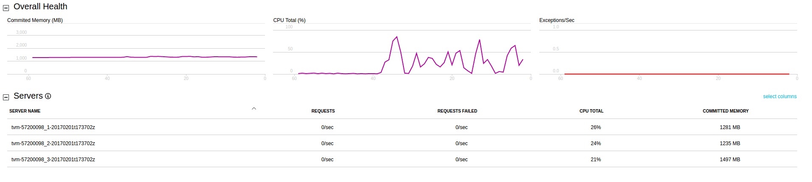
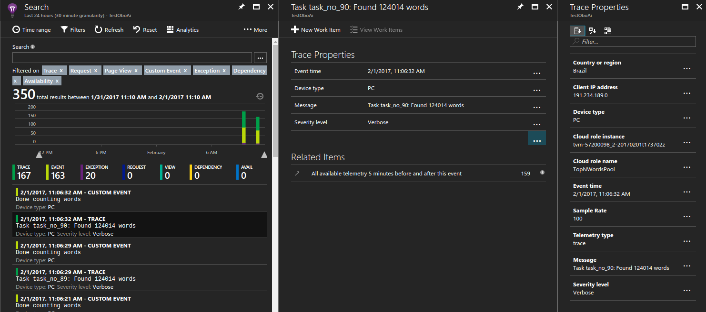
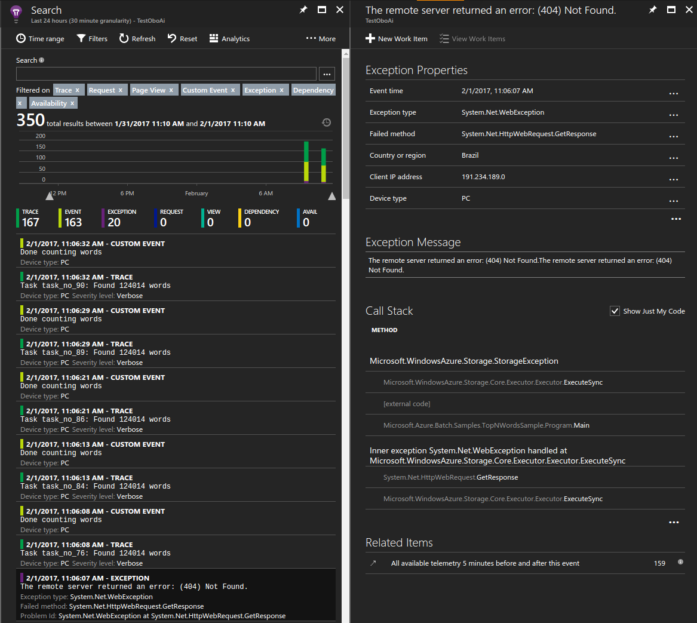
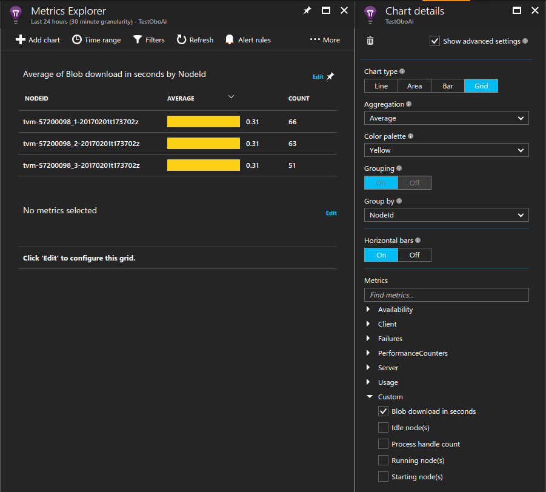

# Monitoring and debugging Azure Batch applications with Application Insights

Application Insights provides an elegant and powerful way to monitor and debug 
applications deployed to Azure services. Using Application Insights you can 
monitor performance counters and exceptions as well as instrument your code 
with custom metrics and tracing. Integrating Application Insights with your 
Azure Batch application allows developers to gain deep insights into behaviors 
and investigate issues in near-real-time.

This article shows how to add and configure the Application Insights library 
into your solution and instrument your application code. Futhermore it provides
examples on how to monitor your application via the Azure portal and build 
custom dashboards.

## Prerequisites
* [Azure Batch account](https://docs.microsoft.com/azure/batch/batch-account-create-portal)
* [Azure Application Insights account](https://docs.microsoft.com/azure/application-insights/app-insights-create-new-resource)
  
  To persist your application logs and performance counters, you must create an Application Insights account where Azure stores data.
  
  > [!WARNING]
  > You may be **charged** for the data stored in your Application Insights account. 
  > This includes the diagnostic and monitoring data discussed in this article.
  > 

## Adding Application Insights to your project

Application Insights is easily installed via a NuGet package. Add the Microsoft.ApplicationInsights.WindowsServer package to your application's project.

```powershell
PM> Install-Package Microsoft.ApplicationInsights.WindowsServer
```

## Get the Application Insights instrumentation key
Once you have created an Application Insights account, copy the instrumentation 
key from the portal as it is required later on.

## Instrumenting your code

Now that you have added the required packages to your project, you can reference them using the **Microsoft.ApplicationInsights** namespace.

First off, we'll need to update the ApplicationInsights.config file with your instrumentation key.

```xml
<InstrumentationKey>YOUR-KEY-GOES-HERE</InstrumentationKey>
```

This example uses the following instrumentation calls:
* TrackMetric() to understand how long, on average, a Compute Node takes to download the required text file.
* TrackTrace() to add debugging calls to our code.
* TrackEvent() to track interesting events we want to capture.

We also inherently track exceptions. This sample purposely leaves out exception 
handling to see how Application Insights automatically reports unhandled 
exceptions for us and significantly improves the debugging experience. The 
following sample illustrates how to use these methods.

```csharp
public void CountWords(string blobUrl, int numTopN)
{
    // simulate exception for some  set of tasks
    Random rand = new Random();
    if (rand.Next(0, 10) % 10 == 0)
    {
        blobUrl += ".badUrl";
    }

    // log the url we are downloading the file from
    insightsClient.TrackTrace(new TraceTelemetry(string.Format("Task {0}: Download file from: {1}", this.taskId, blobUrl), SeverityLevel.Verbose));

    // open the blob that contains the book using DefaultAzureCredential
    BlobClient blob = new BlobClient(new Uri(blobUrl), new DefaultAzureCredential());
    using (Stream memoryStream = new MemoryStream())
    {
        // calculate blob download time
        DateTime start = DateTime.Now;
        blob.DownloadTo(memoryStream);
        TimeSpan downloadTime = DateTime.Now.Subtract(start);

        // track how long the blob takes to download on this node
        // this will help debug timing issues or identify poorly performing nodes
        insightsClient.TrackMetric("Blob download in seconds", downloadTime.TotalSeconds, this.CommonProperties);

        memoryStream.Position = 0; //Reset the stream
        var sr = new StreamReader(memoryStream);
        var myStr = sr.ReadToEnd();
        string[] words = myStr.Split(' ');

        // log how many words were found in the text file
        insightsClient.TrackTrace(new TraceTelemetry(string.Format("Task {0}: Found {1} words", this.taskId, words.Length), SeverityLevel.Verbose));
        var topNWords =
            words.
                Where(word => word.Length > 0).
                GroupBy(word => word, (key, group) => new KeyValuePair<String, long>(key, group.LongCount())).
                OrderByDescending(x => x.Value).
                Take(numTopN).
                ToList();
        foreach (var pair in topNWords)
        {
            Console.WriteLine("{0} {1}", pair.Key, pair.Value);
        }

        // emit an event to track the completion of the task
        insightsClient.TrackEvent("Done counting words");
    }
}
```

### Azure Batch telemetry initializer helper
When reporting telemetry for a given server and instance, Application Insights 
uses the Azure VM Role and VM name for the default values. Since we're running 
in the context of Azure Batch, we would like to use the Pool name and Compute 
Node name instead. A telemetry initializer allows us to override the default 
values. You can learn more about telemetry initializers 
[here](http://apmtips.com/blog/2014/12/01/telemetry-initializers/) or see an 
example on [github](https://github.com/Microsoft/ApplicationInsights-dotnet-server/blob/develop/Src/WindowsServer/WindowsServer.Shared/AzureWebAppRoleEnvironmentTelemetryInitializer.cs).

```csharp

using Microsoft.ApplicationInsights.Channel;
using Microsoft.ApplicationInsights.Extensibility;
using System;
using System.Threading;

namespace Microsoft.Azure.Batch.Samples.TopNWordsSample
{
    public class AzureBatchNodeTelemetryInitializer : ITelemetryInitializer
    {
        // Azure Batch environment variables
        private const string PoolIdEnvironmentVariable = "AZ_BATCH_POOL_ID";
        private const string NodeIdEnvironmentVariable = "AZ_BATCH_NODE_ID";

        private string roleInstanceName;
        private string roleName;

        public void Initialize(ITelemetry telemetry)
        {
            if (string.IsNullOrEmpty(telemetry.Context.Cloud.RoleName))
            {
                // override the role name with the Azure Batch Pool name
                string name = LazyInitializer.EnsureInitialized(ref this.roleName, this.GetPoolName);
                telemetry.Context.Cloud.RoleName = name;
            }

            if (string.IsNullOrEmpty(telemetry.Context.Cloud.RoleInstance))
            {
                // override the role instance with the Azure Batch Compute Node name
                string name = LazyInitializer.EnsureInitialized(ref this.roleInstanceName, this.GetNodeName);
                telemetry.Context.Cloud.RoleInstance = name;
            }
        }

        private string GetPoolName()
        {
            return Environment.GetEnvironmentVariable(PoolIdEnvironmentVariable) ?? string.Empty;
        }

        private string GetNodeName()
        {
            return Environment.GetEnvironmentVariable(NodeIdEnvironmentVariable) ?? string.Empty;
        }
    }
}
```

To enable the telemetry initializer update the Application Insights config.

```xml
<TelemetryInitializers>
    <Add Type="Microsfot.Azure.Batch.Samples.TopNWordsSample.AzureBatchNodeTelemetryInitializer, TopNWordsSample"/>
</TelemetryInitializers>
```

## Update your job and tasks to include the necessary binaries

In order for Application Insights to run correctly on your Compute Nodes, you 
must make sure the binaries are correctly placed. Add the required 
binaries to your task's resource files collection and they will get downloaded 
when your task executes.

First, create a static list of files we need to upload.
```csharp
// application insights config file and assemblies
private const string AIConfig = "ApplicationInsights.config";
private const string AIDllName = "Microsoft.ApplicationInsights.dll";
private const string AIInterceptDllAgentName = "Microsoft.AI.Agent.Intercept.dll";
private const string AIDependencyCollectorName = "Microsoft.AI.DependencyCollector.dll";
private const string AIPerfCounterCollectorName = "Microsoft.AI.PerfCounterCollector.dll";
private const string AIServerTelemetryName = "Microsoft.AI.ServerTelemetryChannel.dll";
private const string AIWindowsServerName = "Microsoft.AI.WindowsServer.dll";
```

Next, upload the binaries to a single staging container in Blob Storage and obtain `ResourceFile` references for them.
```csharp
// Collect the executable, its dependencies, and the Application Insights config + assemblies.
List<string> binaries = new List<string>
{
    TopNWordsExeName,
    AIConfig,
    AIDllName,
    AIDependencyCollectorName,
    AIInterceptDllAgentName,
    AIPerfCounterCollectorName,
    AIServerTelemetryName,
    AIWindowsServerName,
};

// Upload the files to a single container; each task will reference the entire container as a ResourceFile.
List<ResourceFile> binaryResources = await FileStager.StageFilesAsContainerAsync(
    blobServiceClient,
    stagingContainerName,
    binaries.Select(name => Path.Combine(AppDomain.CurrentDomain.BaseDirectory, name)).ToList());
```

> `FileStager.StageFilesAsContainerAsync` is a helper in the sample's `Common` project that uploads files to an
> Azure Storage container and returns container-scoped `ResourceFile` references using a user-delegation SAS
> issued via `DefaultAzureCredential`.

Finally add the tasks to the job and include the necessary Application Insights binaries.
```csharp
// initialize a collection to hold the tasks that will be submitted in their entirety
var tasksToRun = new List<BatchTaskCreateOptions>(topNWordsConfiguration.NumberOfTasks);
for (int i = 1; i <= topNWordsConfiguration.NumberOfTasks; i++)
{
    string commandLine = $"{TopNWordsExeName} --Task {bookBlobUrl} {topNWordsConfiguration.TopWordCount}";
    var task = new BatchTaskCreateOptions("task_no_" + i, commandLine);

    // Reference the staging container so all of the staged binaries are downloaded to the node.
    foreach (ResourceFile rf in binaryResources)
    {
        task.ResourceFiles.Add(rf);
    }

    tasksToRun.Add(task);
}

// Submit the tasks in a single bulk add.
await batchClient.CreateTaskCollectionAsync(topNWordsConfiguration.JobId, new BatchTaskGroup(tasksToRun));
```

## Viewing data in the Azure portal

Now that we have our job and tasks configured to use Application Insights, run 
the job in your pool. Navigate to the Azure portal and open the Application 
Insghts service that you provisioned. At this point, you should start to see 
data flowing and getting logged. In this article we'll only touch on a few 
features, but feel free to explore the full feature set provided by the 
Application Insights service.

### View live stream data

The following screenshot shows how we can view live data coming from the 
Compute Nodes in the pool, for example the CPU usage per Compute Node.



### Viewing trace logs

Opening up the Search blade in the portal reveals a list of diagnostic data 
captured by Application Insights including traces, events, exceptions, and more. 
In the following screenshot, we see how a single trace for a task is logged and 
can later be queried for debugging purposes.



### View unhandled exceptions

The following image shows how Application Insights logs exceptions thrown from your application. In this case, within seconds of the application throwing the exception we are able to drill into a specific exception and diagnose the issue.



### Measuring blob download time

Custom metrics are also a valuable tool in the portal. The following image shows how the average time it took each Compute Node to download the required text file it was operating against.



To create a chart such as the one above you can:
1. Open the Metrics blade in your Application Insights account.
2. Click 'Add chart'.
3. Click 'Edit' on the chart that was added.
4. Update the chart details as shown in the image above.

## Getting performance counters from Compute Nodes when no tasks are running

You may have noticed that all metrics, including performance counters are only 
logged when the tasks are running. This behavior is useful because it limits 
data getting logged to your Application Insights account. There are cases 
when you would always like to monitor the Compute Nodes, for example they are 
running background work which is not scheduled via the Batch service. In this 
case it can be useful to have a monitoring process running for the life of the 
Compute Node. One way to achieve this behavior is to spawn a process that loads 
the Application Insights library and runs in the background. We can set the 
Application Insights configuration file to emit data we're interested in, such 
as performance counters. In the samples we use the start task to load the 
binaries on the machine and keep a process running indefinitely.

```csharp
// Build a pool definition via the Azure Resource Manager (control plane) Batch SDK.
BatchAccountPoolData poolData = new BatchAccountPoolData
{
    VmSize = "standard_d2_v3",
    DeploymentVmConfiguration = new BatchVmConfiguration(
        new BatchImageReference
        {
            Publisher = topNWordsConfiguration.ImagePublisher,
            Offer = topNWordsConfiguration.ImageOffer,
            Sku = topNWordsConfiguration.ImageSku,
            Version = topNWordsConfiguration.ImageVersion,
        },
        topNWordsConfiguration.NodeAgentSkuId),
    ScaleSettings = new BatchAccountPoolScaleSettings
    {
        FixedScale = new BatchAccountFixedScaleSettings
        {
            TargetDedicatedNodes = topNWordsConfiguration.PoolNodeCount,
        },
    },
};

// List of files required to run the start task.
List<string> files = new List<string>
{
    BatchApplicationInsightsAssemblyExeName,
    ApplicationInsightsConfigName,
    AIDllName,
    AIDependencyCollectorName,
    AIInterceptDllAgentName,
    AIPerfCounterCollectorName,
    AIServerTelemetryName,
    AIWindowsServerName,
};

// Upload the start-task assets to Blob Storage and produce ResourceFile references
// (uses DefaultAzureCredential + a user-delegation SAS under the covers).
List<ResourceFile> resourceFiles = await SampleHelpers.UploadResourcesAndCreateResourceFileReferencesAsync(
    blobServiceClient,
    "monitoringdemo",
    files);

// Configure a start task that runs a small exe in the background to emit performance counter data
// as defined in the relevant ApplicationInsights.config. waitForSuccess is left unset so the compute
// node becomes available immediately after the command is launched.
poolData.StartTask = new BatchAccountPoolStartTask
{
    CommandLine = "cmd /c BatchApplicationInsightsAssembly.exe",
};
foreach (ResourceFile rf in resourceFiles)
{
    poolData.StartTask.ResourceFiles.Add(new BatchResourceFile
    {
        BlobContainerUri = rf.StorageContainerUri,
        HttpUri = rf.HttpUri,
        FilePath = rf.FilePath,
    });
}

await GettingStartedCommon.CreatePoolIfNotExistAsync(batchAccount, topNWordsConfiguration.PoolId, poolData);
```

> Tip: To increase the manageability of your solution, you can bundle this up 
> into an [application package](./batch-application-packages.md). The application package can then be deployed 
> automatically to your pools by adding an application package reference.

## Throttling and sampling data in Application Insights

Due to the large-scale nature of Azure Batch workloads, for applications 
running in production you may want to limit the amount of data collected by 
Application Insights to manage costs. 
This [article](https://docs.microsoft.com/en-us/azure/application-insights/app-insights-sampling) provides some mechanisms to achieve this.


## More reading ...
Learn more about [Application Insights](https://docs.microsoft.com/en-us/azure/application-insights/).

For Application Insights support in other languages look at the 
[languages, platforms and integrations documentation](https://docs.microsoft.com/en-us/azure/application-insights/app-insights-platforms).